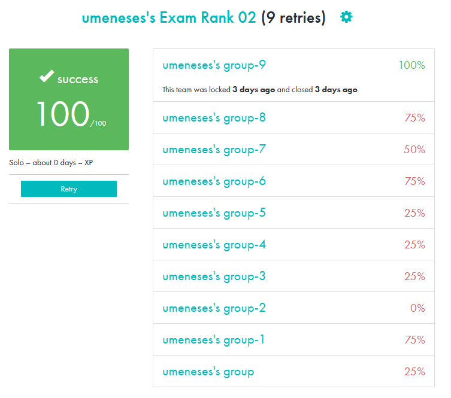

# 42_exam_training

### Hi, there! 👋
This is my repo for studies about the 42 Exam Rank 02, at [42 São Paulo](https://42sp.org.br/)

I bravely encourage you two things:
 - Study with the repo [Pasquale Rossi](https://github.com/pasqualerossi/42-School-Exam-Rank-02)
 - Produce a short [Makefile](https://github.com/biralavor/42_exam_training/blob/main/Exam_Rank_02/Level_0/first_word/Makefile), like this one: 

### Why Build a Makefile on the Exam?
- ✅ For a faster test experience
- ✅ To decrease compilation errors
- ✅ To easily have a GDB debugger
- ✅ To easily have a VALGRIND debugger
- ✅ And, most important: **to compare subject examples with YOUR RESULTS**
- ❌ Yes, your first Makefile production tries will comsumes some time...
  - But, after a few attemps, I had my Makefile exam ready after 7 minutes ✅ \o/
  

Please, use the TTA method (Try-Try-Again) for **many days** (or weeks like me)

